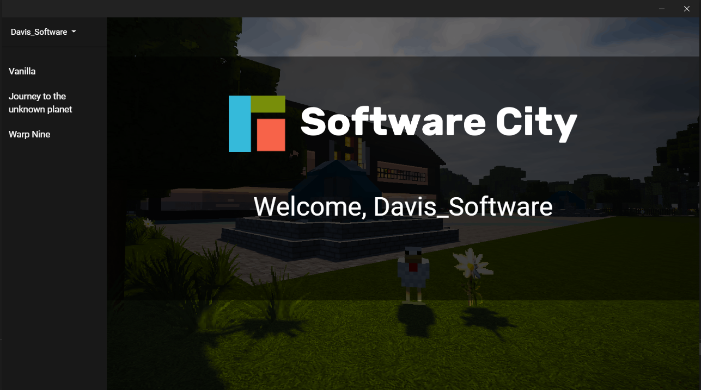
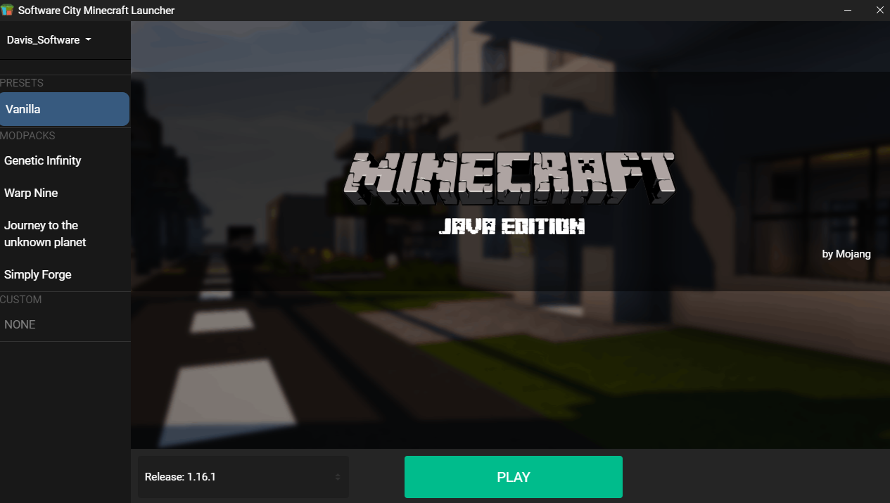

# swc_mclauncher

More detailed readme will follow...

## activate dev-mode

In order to activate devMode, you can:

- Edit the file `%APPDATA%\SWC Minecraft Launcher\settings.json` and
  change `devMode` to `true` at the end of the file
  
or  

- Press `Ctrl + Shift + I` in teh launcher then in the console enter `setVal("devMode", true)` and restart
